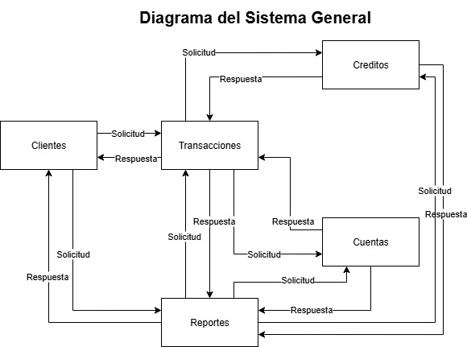

# Proyecto de Microservicios Bancarios

## Descripción del Proyecto
Este proyecto corresponde a un **sistema bancario basado en microservicios**, donde cada servicio gestiona de manera independiente sus datos y reglas de negocio.

## Microservicio: Credits
El microservicio **Credits** se encarga de **administrar los créditos de clientes personales y empresariales**, así como las **tarjetas de crédito**.  
Su responsabilidad es manejar el ciclo de vida de los créditos y sus operaciones de negocio.

## Diagrama de Flujo General

## Diagrama de Secuencia - Microservicio Credits

## Base URL
Por defecto en desarrollo local: `http://localhost:8585/api/v1`

### Endpoints

- **POST /credits** → Registrar crédito
- **GET /credits** → Listar créditos (query param `customerId` opcional)
- **GET /credits/{id}** → Obtener crédito por ID
- **PUT /credits/{id}** → Actualizar crédito
- **DELETE /credits/{id}** → Eliminar crédito

**Operaciones de negocio**:
- **POST /credits/{id}/payments** → Aplicar pago
- **POST /credits/{id}/charges** → Aplicar cargo
- **GET /credits/{id}/balance** → Consultar saldo
